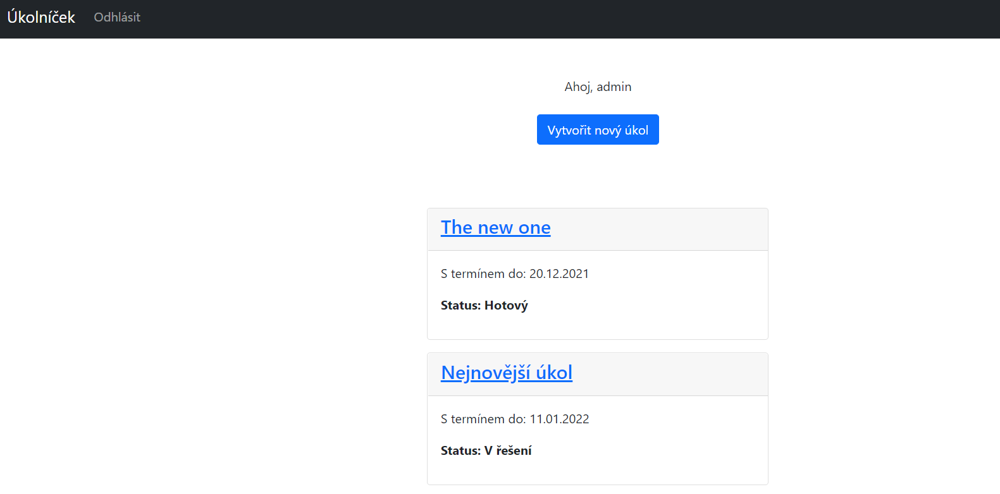
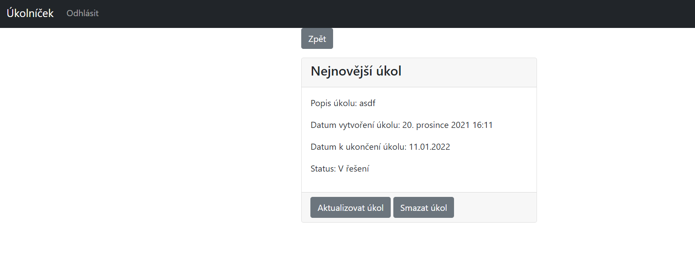

# TODO APP

A simple web application for creating tasks. The registered user can create their own tasks and then update them, add new steps, change the status of tasks or delete them.

## The app is built with:
* Python
* Django
* SQlite
* HTML
* Bootstrap
* Git

## Printscreens of the app

